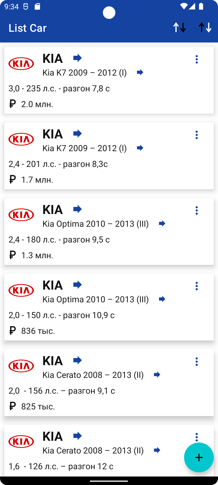
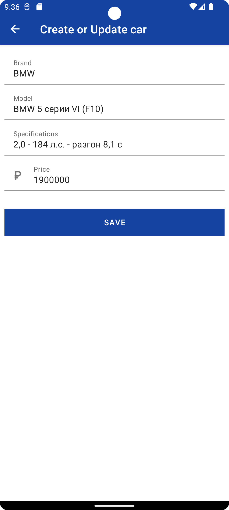
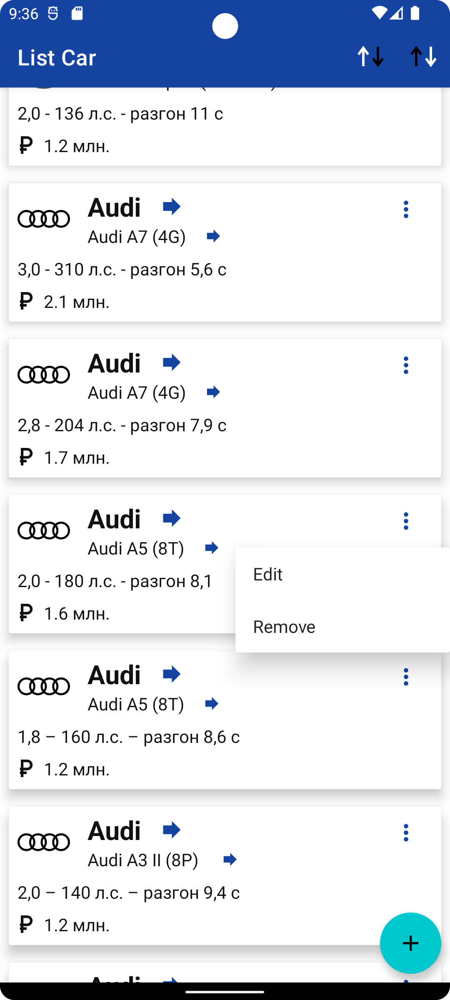
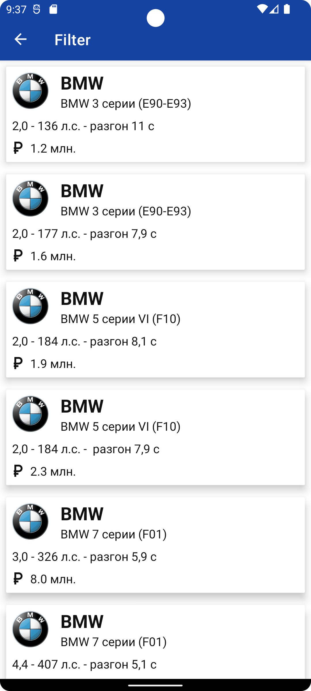
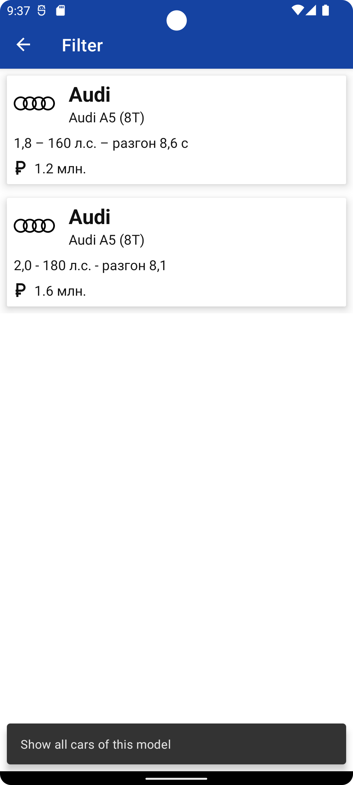

## ListCar

**Реализовано:**

- отображение списка машин

- добавление, удаление, редактирование

            

- сортировка по бренду, модели и цене

            

- Создана внешняя БД в DB_SQL, внедрена с помощью Room. Демонстрация данных реализована с помощью
  Recycle
- Использована архитектура MVVM
- Библиотеки Room, Coroutines, Recyclerview, Hilt
